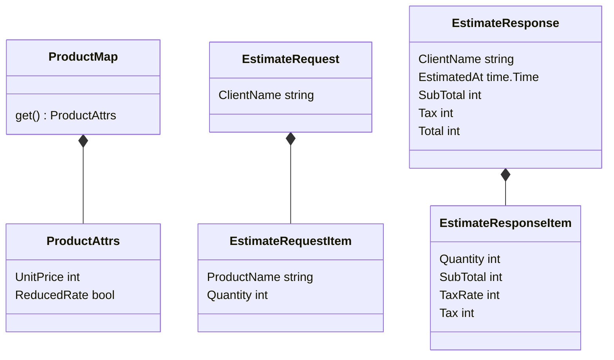

# estimate サブコマンド設計ログ

## まず必要そうな型を列挙してみる

```mermaid
classDiagram
ProductMap *-- ProductAttrs
ProductMap : get() ProductAttrs
ProductAttrs : UnitPrice int
ProductAttrs : ReducedRate bool
EstimateRequest *-- EstimateRequestItem
EstimateRequest : ClientName string
EstimateRequestItem : ProductName string
EstimateRequestItem : Quantity int
EstimateResponse *-- EstimateResponseItem
EstimateResponse : ClientName string
EstimateResponse : EstimatedAt time.Time
EstimateResponse : SubTotal int
EstimateResponse : Tax int
EstimateResponse : Total int
EstimateResponseItem : Quantity int
EstimateResponseItem : SubTotal int
EstimateResponseItem : TaxRate int
EstimateResponseItem : Tax int
```

ProductMap は `map[string]*ProductAttrs` で十分？
