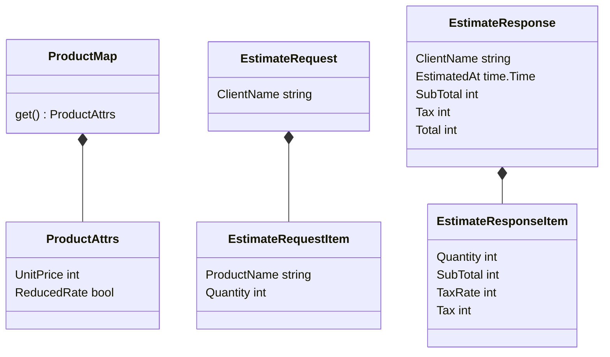
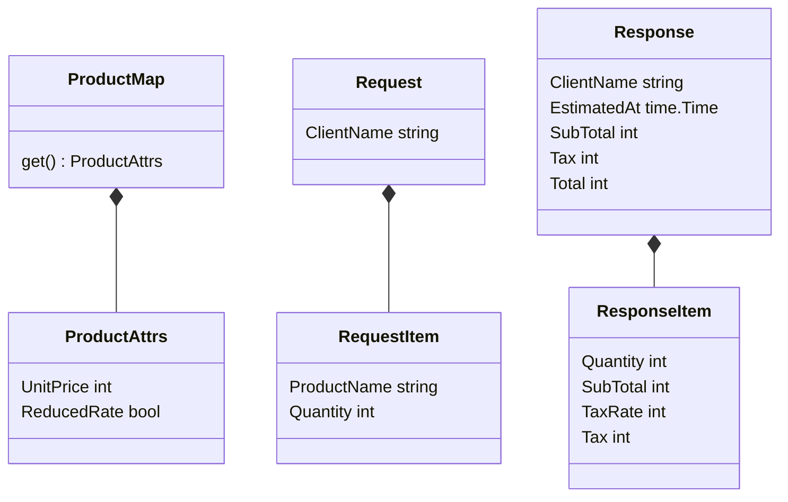

# estimate サブコマンド設計ログ

## まず必要そうな型を列挙してみる

```mermaid
classDiagram
ProductMap *-- ProductAttrs
ProductMap : get() ProductAttrs
ProductAttrs : UnitPrice int
ProductAttrs : ReducedRate bool
EstimateRequest *-- EstimateRequestItem
EstimateRequest : ClientName string
EstimateRequestItem : ProductName string
EstimateRequestItem : Quantity int
EstimateResponse *-- EstimateResponseItem
EstimateResponse : ClientName string
EstimateResponse : EstimatedAt time.Time
EstimateResponse : SubTotal int
EstimateResponse : Tax int
EstimateResponse : Total int
EstimateResponseItem : Quantity int
EstimateResponseItem : SubTotal int
EstimateResponseItem : TaxRate int
EstimateResponseItem : Tax int
```

ProductMap は `map[string]*ProductAttrs` で十分？

### 名前が長いのでEstimateを除去する

他に `Request` や `Response` を使うことは（今のところ）なさそうなので名前を短くしてしまう

```mermaid
classDiagram
ProductMap *-- ProductAttrs
ProductMap : get() ProductAttrs
ProductAttrs : UnitPrice int
ProductAttrs : ReducedRate bool
Request *-- RequestItem
Request : ClientName string
RequestItem : ProductName string
RequestItem : Quantity int
Response *-- ResponseItem
Response : ClientName string
Response : EstimatedAt time.Time
Response : SubTotal int
Response : Tax int
Response : Total int
ResponseItem : Quantity int
ResponseItem : SubTotal int
ResponseItem : TaxRate int
ResponseItem : Tax int
```
