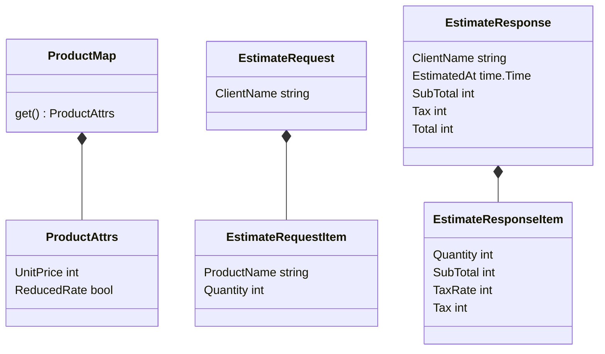
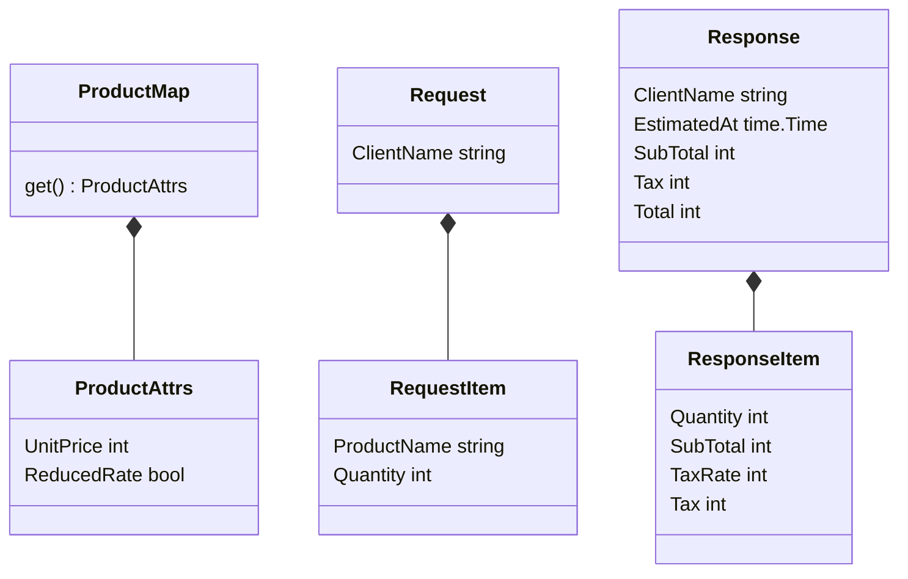
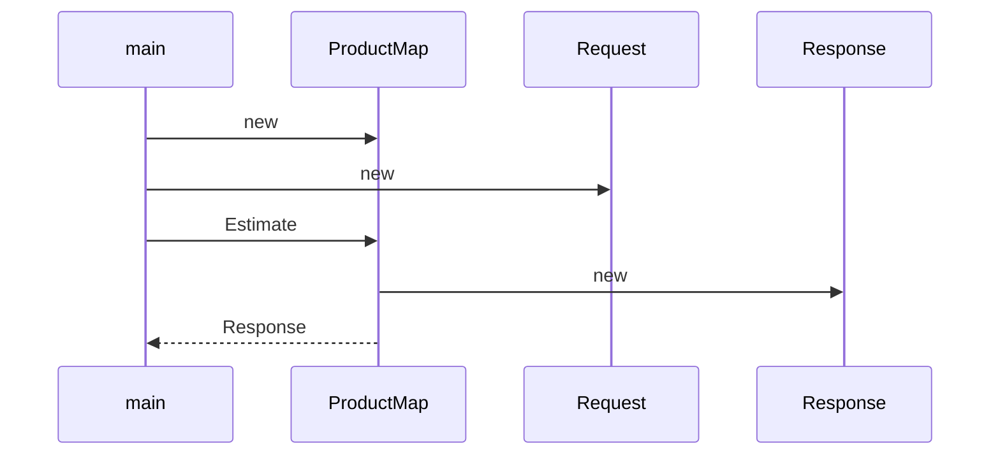
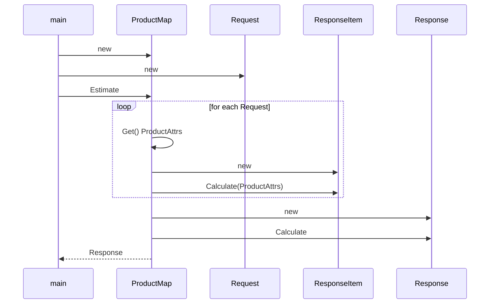

# estimate サブコマンド設計ログ

## まず必要そうな型を列挙してみる

ProductMap は `map[string]*ProductAttrs` で十分？

### 名前が長いのでEstimateを除去する

他に `Request` や `Response` を使うことは（今のところ）なさそうなので名前を短くしてしまう

## メソッドの呼び出しを決める

### どうあるべきかを考える

ProductMapとRequestからResponseを作るという処理なわけだが、RequestとResponseが対称的なものなので、
引数にRequestを取ってResponseを返すというのがわかりやすそう。
そうするとProductMapの使い方としては以下の２つがありそう。

1. グローバルな `Estimate` 関数に引数として `ProductMap` と `Request` を渡して `Response` を返す
2. `ProductMap` のメソッドとして `Request` を引数にとる `Estimate` が `Response` を返す

どちらかと言えば 2 の方が責務が分かれるので良さそう。

### シーケンス図その1

最初はどこでどのインスタンスを作るのかをざっくり考える。
この時点ではまだResponseItemをどう作るとかまでは考えていない。

### シーケンス図その２

どこで計算を行うのかを考えて決める。ここで細かいローカル変数などは考慮しない。
主に型と型の間のやり取り（インスタンスの生成とメソッドの呼び出し）を考慮する。
あくまで実装前のアイディア段階なので、実装したら変わってしまってもOKとする
（設計作業の結果を設計図として残してメンテナンス対象とするなら話は別）。
